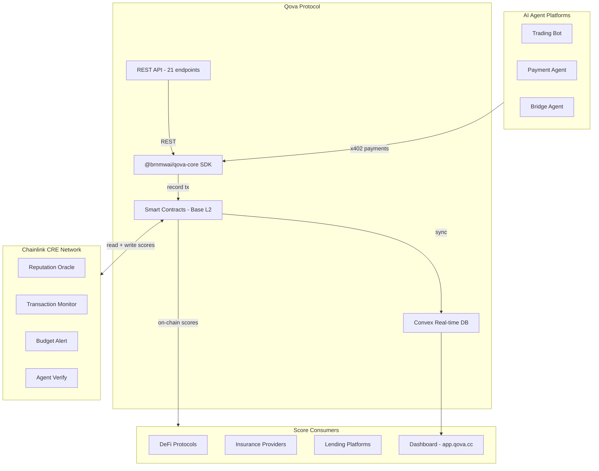
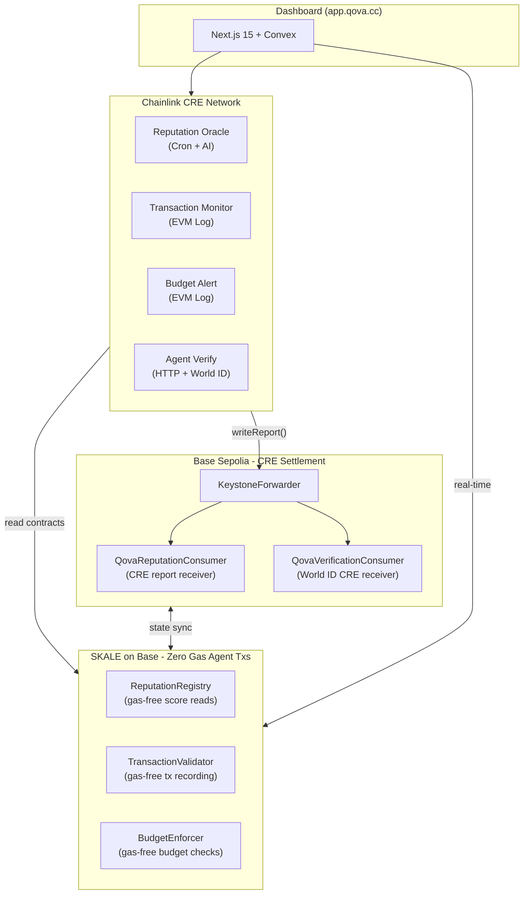
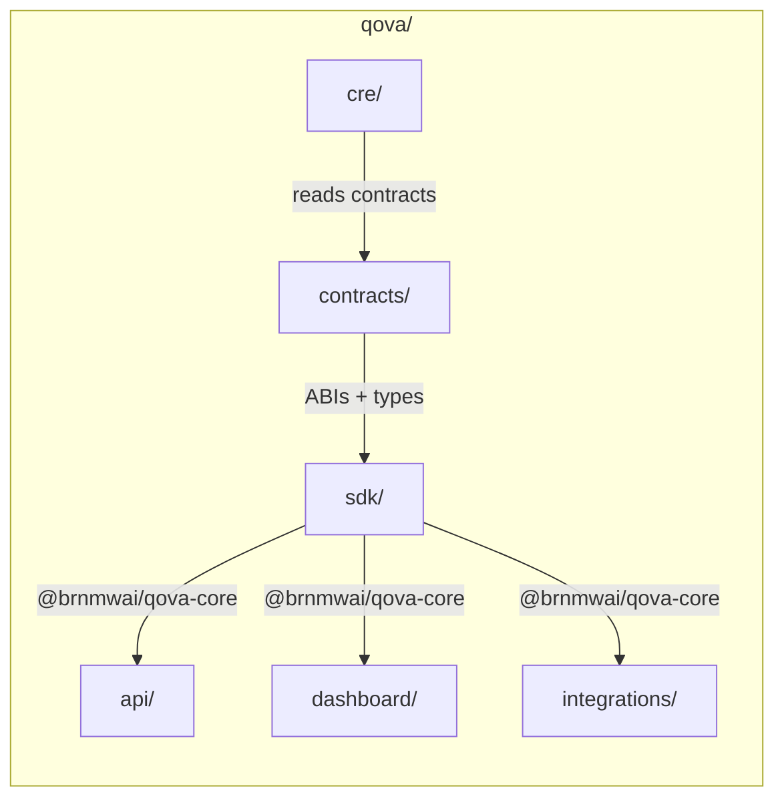
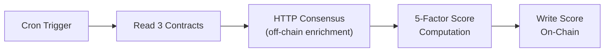
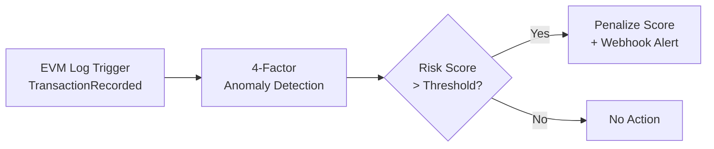
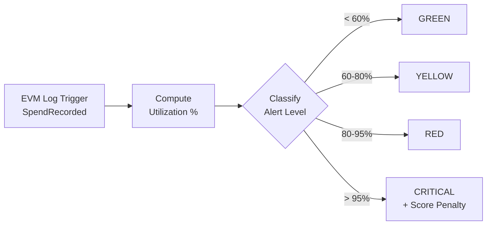

<p align="center">
  
</p>

<p align="center">
  <a href="https://app.qova.cc">Dashboard</a> -
  <a href="https://docs.qova.cc">Docs</a> -
  <a href="https://qova.cc">Website</a>
</p>

<p align="center">
  <a href="https://www.npmjs.com/package/@brnmwai/qova-core"></a>
  
  
  
  
  
</p>

---

Qova is a credit bureau for autonomous AI agents. As agents transact on-chain via protocols like x402, Qova computes verifiable reputation scores (0-1000) from on-chain transaction data using Chainlink CRE, then writes those scores back on-chain for any protocol to consume. Think Equifax, but for AI.

<p align="center">
  <a href="https://youtu.be/g0TLMmjwJt4">
    
  </a>
</p>
<p align="center">
  <a href="https://youtu.be/g0TLMmjwJt4">Watch the demo</a>
</p>

---

## Simulations

### CRE & AI - reputation-oracle


### Risk & Compliance - transaction-monitor + budget-alert


### World ID with CRE - agent-verify


### On-Chain Proof


### Badge API


---

## How It Works



### The Scoring Pipeline

```
1. Agent transacts on-chain          -->  Transaction recorded in smart contract
2. Chainlink CRE detects event       -->  4 decentralized workflows trigger
3. Workflows compute score factors   -->  BFT consensus across oracle nodes
4. Score written back on-chain       -->  Any protocol can read it
5. Dashboard updates in real-time    -->  Convex syncs instantly
```

### Credit Rating Scale

| Grade | Score | Risk Level | What It Means |
|:-----:|:-----:|:----------:|:-------------|
| **AAA** | 950-1000 | Minimal | Exceptional track record, highest trust |
| **AA** | 900-949 | Very Low | Excellent history, very reliable |
| **A** | 850-899 | Low | Strong performance, trustworthy |
| **BBB** | 750-849 | Moderate | Good standing, investment grade |
| **BB** | 650-749 | Notable | Fair record, room for improvement |
| **B** | 550-649 | Elevated | Adequate but limited history |
| **CCC** | 450-549 | High | Below average, caution advised |
| **CC** | 350-449 | Very High | Poor record, significant risk |
| **C** | 250-349 | Severe | Very poor, near default |
| **D** | 0-249 | Critical | Default risk, avoid |

### Scoring Factors

| Factor | Weight | Source |
|:-------|:------:|:-------|
| Success Rate | 30% | TransactionValidator contract |
| Transaction Volume | 25% | TransactionValidator contract |
| Transaction Count | 20% | TransactionValidator contract |
| Budget Compliance | 15% | BudgetEnforcer contract |
| Account Age | 10% | ReputationRegistry contract |

---

## Chainlink Integration Map

> **Hackathon requirement**: "README must link to all files that use Chainlink."

### CRE Workflows (`cre/`)

| Workflow | File | Trigger | Purpose |
|:---------|:-----|:--------|:--------|
| Reputation Oracle | [`cre/reputation-oracle/main.ts`](./cre/reputation-oracle/main.ts) | Cron (10min) | AI-enhanced reputation scoring with Groq Llama 3.1 70B via `runInNodeMode` |
| Transaction Monitor | [`cre/transaction-monitor/main.ts`](./cre/transaction-monitor/main.ts) | EVM Log (`TransactionRecorded`) | Real-time anomaly detection with 4-factor risk scoring |
| Budget Alert | [`cre/budget-alert/main.ts`](./cre/budget-alert/main.ts) | EVM Log (`SpendRecorded`) | Budget threshold enforcement with tiered alerts |
| Agent Verify | [`cre/agent-verify/main.ts`](./cre/agent-verify/main.ts) | HTTP POST | World ID verification orchestrated by CRE (with `authorizedKeys` for production) |

### Smart Contracts (`contracts/src/`)

| Contract | File | Chainlink Usage |
|:---------|:-----|:----------------|
| QovaReputationConsumer | [`contracts/src/QovaReputationConsumer.sol`](./contracts/src/QovaReputationConsumer.sol) | CRE report receiver (`IReceiver.onReport`) with replay protection |
| QovaVerificationConsumer | [`contracts/src/QovaVerificationConsumer.sol`](./contracts/src/QovaVerificationConsumer.sol) | CRE report receiver for World ID sybil-resistant verification |
| CrossChainReputation | [`contracts/src/CrossChainReputation.sol`](./contracts/src/CrossChainReputation.sol) | CCIP cross-chain reputation sync |
| PriceFeedConsumer | [`contracts/src/PriceFeedConsumer.sol`](./contracts/src/PriceFeedConsumer.sol) | Chainlink Data Feeds for price conversion |

### CRE Configuration

| File | Purpose |
|:-----|:--------|
| [`cre/project.yaml`](./cre/project.yaml) | Global CRE project config (targets, RPCs, chain selectors) |
| [`cre/secrets.yaml`](./cre/secrets.yaml) | Secret declarations (AI_API_KEY, WORLD_ID_APP_ID) |
| [`cre/reputation-oracle/config.json`](./cre/reputation-oracle/config.json) | Reputation oracle config (contract addresses, schedule, AI toggle) |
| [`cre/transaction-monitor/config.json`](./cre/transaction-monitor/config.json) | Transaction monitor config (thresholds, contract address) |
| [`cre/budget-alert/config.json`](./cre/budget-alert/config.json) | Budget alert config (utilization thresholds) |
| [`cre/agent-verify/config.json`](./cre/agent-verify/config.json) | Agent verification config (World ID app ID, min score) |

### CRE Consumer Base Contracts

| File | Purpose |
|:-----|:--------|
| [`contracts/src/interfaces/IReceiver.sol`](./contracts/src/interfaces/IReceiver.sol) | CRE `IReceiver` interface (`onReport(metadata, report)`) |
| [`contracts/src/base/CREReceiver.sol`](./contracts/src/base/CREReceiver.sol) | Base contract with forwarder validation (`_validateReport`) |

---

## Prize Tracks

| Track | Prize | What Qova Does |
|:------|:------|:---------------|
| **CRE & AI** | $10,500 | AI-enhanced reputation scoring with Groq Llama 3.1 70B running inside CRE `runInNodeMode`. DON nodes reach consensus on AI-generated behavioral analysis before writing scores on-chain. |
| **Risk & Compliance** | $10,000 | Real-time anomaly detection via `TransactionRecorded` EVM Log trigger (4-factor risk scoring) + automated budget enforcement via `SpendRecorded` EVM Log trigger (tiered alerts with score penalties). |
| **World ID with CRE** | $3,000 | Off-chain World ID proof verification orchestrated entirely by CRE. HTTP trigger receives proof, DON nodes independently verify against World ID API, consensus writes sybil-resistant verification status to Base via `QovaVerificationConsumer`. |
| **Tenderly** | $5,000 | All 4 CRE workflows orchestrated and tested on Tenderly Virtual TestNets. Contracts deployed with demo agents, scores, and transactions. CRE reads/writes against Virtual TestNet with real-time mainnet state. Full transaction history visible in public explorer. |
| **Top 10** | $1,500 | Full CRE-native architecture with 4 workflows, 3 trigger types (Cron, EVM Log, HTTP), AI integration, cross-chain design, and 348 passing tests. |

---

## Dual-Chain Architecture



**Why dual-chain:** CRE workflows settle on Base Sepolia (where Chainlink's KeystoneForwarder lives). Agent day-to-day transactions happen on SKALE on Base with zero gas fees, making high-frequency score updates economically viable. Premium reputation lookups use x402 micropayments settled on SKALE.

---

## Tenderly Virtual TestNet Integration

Qova's CRE workflows are developed, tested, and validated on [Tenderly Virtual TestNets](https://docs.tenderly.co/virtual-testnets) - providing a controlled environment with real Base Sepolia state, unlimited faucets, and full transaction debugging.

### Why Virtual TestNets

| Benefit | How Qova Uses It |
|:--------|:-----------------|
| **Real mainnet state** | Virtual TestNet forks Base Sepolia at the latest block, giving CRE workflows access to real contract state and transaction history |
| **Zero-setup testing** | Deploy all 4 contracts + seed demo agents in a single command with unlimited ETH |
| **Built-in debugging** | Step-through debugger for every CRE workflow write transaction - trace reverts, inspect storage, profile gas |
| **Public explorer** | Judges and reviewers can inspect all deployed contracts and transaction history without RPC access |
| **Isolated environment** | Test CRE score updates, anomaly detection, and budget enforcement without affecting real testnet state |

### Deployed Contracts (Tenderly Virtual TestNet)

| Contract | Address | Txs |
|:---------|:--------|:---:|
| **ReputationRegistry** | `0xc668460Cbc34bd3f591e09f6cE8FF0e5A6782236` | 4 |
| **TransactionValidator** | `0xCF58A0E4e44dbf54B43F6eF3873EE6988a9a9776` | 3 |
| **BudgetEnforcer** | `0x29f71a3781BCeDfD1C2908F612f1c92DdF976f58` | 2 |
| **QovaCore** | `0xD562712A86e8AEc7881c9d8b0c8eC47021a47208` | - |

**Demo state**: 1 agent registered (score 750, BBB grade), 1 transaction recorded, all roles granted.

### CRE Workflow Execution on Virtual TestNet

All 4 CRE workflows are configured to run against the Tenderly Virtual TestNet via dedicated targets in [`cre/project.yaml`](./cre/project.yaml):

```bash
# Simulate CRE workflows against Tenderly Virtual TestNet
cre workflow simulate reputation-oracle   --target tenderly-reputation-oracle
cre workflow simulate transaction-monitor --target tenderly-transaction-monitor
cre workflow simulate budget-alert        --target tenderly-budget-alert
cre workflow simulate agent-verify        --target tenderly-agent-verify
```

**How it works:**
1. CRE workflow triggers (cron/log/http)
2. Workflow reads contract state from Tenderly Virtual TestNet RPC
3. Computes score/anomaly/budget via BFT consensus across DON nodes
4. Writes result back to Virtual TestNet via `writeReport()`
5. All transactions visible in Tenderly's public explorer with full trace data

### Deploy to Tenderly

```bash
# 1. Create Virtual TestNet at https://dashboard.tenderly.co
#    Fork Base Sepolia (chain 84532), enable Public Explorer

# 2. Set RPC URL in contracts/.env
TENDERLY_VIRTUAL_TESTNET_RPC=https://virtual.rpc.tenderly.co/...

# 3. Deploy all contracts + seed demo data
cd contracts && bash scripts/deploy-tenderly.sh

# 4. Run CRE workflows against Tenderly
cd cre
cre workflow simulate reputation-oracle --target tenderly-reputation-oracle
```

### Files

| File | Purpose |
|:-----|:--------|
| [`contracts/script/DeployTenderly.s.sol`](./contracts/script/DeployTenderly.s.sol) | Full deployment script with demo agent seeding |
| [`contracts/scripts/deploy-tenderly.sh`](./contracts/scripts/deploy-tenderly.sh) | Shell helper for deploy + address export |
| [`contracts/deployments/tenderly-virtual.json`](./contracts/deployments/tenderly-virtual.json) | Deployed contract addresses and metadata |
| [`cre/project.yaml`](./cre/project.yaml) | CRE workflow targets (`tenderly-*` section) |
| [`contracts/foundry.toml`](./contracts/foundry.toml) | Tenderly RPC endpoint configuration |

---

## Architecture



### Monorepo Packages

| Package | Description | Tech | Entry |
|:--------|:-----------|:-----|:------|
| [`contracts/`](./contracts) | On-chain reputation, transactions, budgets | Solidity 0.8.28, Foundry, OpenZeppelin v5 | `src/*.sol` |
| [`sdk/`](./sdk) | TypeScript SDK for all contract interactions | viem, Zod, ESM | `src/index.ts` |
| [`api/`](./api) | REST API with 21 endpoints, rate limiting, caching | Hono 4.7, Bun | `src/index.ts` |
| [`dashboard/`](./dashboard) | Real-time analytics dashboard with 21+ pages | Next.js 15, React 19, Convex, Clerk | `src/app/` |
| [`cre/`](./cre) | 4 Chainlink CRE decentralized scoring workflows | @chainlink/cre-sdk v1.1.2 | `*/index.ts` |
| [`integrations/`](./integrations) | Framework plugins for agent platforms | LangGraph, CrewAI, n8n | Per-package |

---

## Smart Contracts

Deployed and verified on **Base Sepolia** (Chain ID: 84532) and **SKALE Base** (Chain ID: 1187947933).

| Contract | Address (Base Sepolia) | Purpose |
|:---------|:----------------------|:--------|
| **ReputationRegistry** | [`0x0b2466b01E...563fBB`](https://sepolia.basescan.org/address/0x0b2466b01E6d73A24D9C716A9072ED3923563fBB) | Score storage (0-1000), agent registration, update history |
| **TransactionValidator** | [`0x5d7a7AEAb2...e900`](https://sepolia.basescan.org/address/0x5d7a7AEAb26D2F0076892D1C9A28F230EbB3e900) | Transaction recording, volume tracking, success rates |
| **BudgetEnforcer** | [`0x27161878...C76E`](https://sepolia.basescan.org/address/0x271618781040dc358e4F6B66561b65A839b0C76E) | Per-agent spending limits (daily/monthly/per-tx) |
| **QovaCore** | [`0x9Ee4ae0bD9...f76a`](https://sepolia.basescan.org/address/0x9Ee4ae0bD93E95498fB6AB444ae6205d56fEf76a) | Facade coordinating cross-contract operations |
| **QovaReputationConsumer** | - | CRE report consumer for on-chain score updates |
| **CrossChainReputation** | - | CCIP cross-chain reputation sync |
| **PriceFeedConsumer** | - | Chainlink price feed integration |

**Access Control** (OpenZeppelin v5):
- `UPDATER_ROLE` on ReputationRegistry (granted to QovaCore)
- `RECORDER_ROLE` on TransactionValidator (granted to QovaCore)
- `BUDGET_MANAGER_ROLE` on BudgetEnforcer (granted to QovaCore)

---

## Chainlink CRE Workflows

Four decentralized workflows built with `@chainlink/cre-sdk` v1.1.2. All computation functions are pure and deterministic for BFT consensus safety. **90 unit tests** across 6 test files.

### 1. Reputation Oracle



Scheduled workflow that reads agent data from all three contracts, fetches off-chain enrichment via HTTP consensus, computes the weighted score, and writes the result on-chain.

### 2. Transaction Monitor



| Risk Factor | Weight |
|:-----------|:------:|
| Frequency Anomaly | 30% |
| Large Value | 25% |
| Failure Rate | 25% |
| Flagged Contracts | 20% |

### 3. Budget Alert



### 4. Agent Verify

On-demand verification via HTTP POST with `KEY_TYPE_ECDSA_EVM` authorization keys for production deployments. Runs **8 checks**: registration, contract existence, account age, owner consistency, activity level, ownership stability, sanctions screening, minimum score. Returns `VERIFIED` / `PARTIALLY_VERIFIED` / `UNVERIFIED` / `SUSPICIOUS` with credit grade.

---

## REST API

**21 endpoints** on Hono + Bun (port 3001). Rate-limited, cached, validated with Zod.

### Agent Endpoints

| Method | Path | Description | Rate Limit |
|:------:|:-----|:-----------|:----------:|
| `GET` | `/api/agents` | List all agents | 100/min |
| `GET` | `/api/agents/:address` | Agent details + enriched score | 100/min |
| `GET` | `/api/agents/:address/score` | Score + grade + color | 100/min |
| `POST` | `/api/agents/register` | Register new agent | 20/min |
| `POST` | `/api/agents/:address/score` | Update score | 100/min |
| `POST` | `/api/agents/batch-scores` | Batch update scores | 10/min |

### Transaction Endpoints

| Method | Path | Description | Rate Limit |
|:------:|:-----|:-----------|:----------:|
| `GET` | `/api/transactions/:address/stats` | Transaction statistics | 100/min |
| `POST` | `/api/transactions/record` | Record transaction | 100/min |

### Budget Endpoints

| Method | Path | Description | Rate Limit |
|:------:|:-----|:-----------|:----------:|
| `GET` | `/api/budgets/:address` | Budget status | 100/min |
| `POST` | `/api/budgets/:address/set` | Set spending limits | 100/min |
| `POST` | `/api/budgets/:address/check` | Check budget compliance | 100/min |
| `POST` | `/api/budgets/:address/spend` | Record spend | 100/min |

### Score Endpoints (CRE-Compatible)

| Method | Path | Description | Rate Limit |
|:------:|:-----|:-----------|:----------:|
| `GET` | `/api/scores/agents` | List agents (CRE format) | 100/min |
| `GET` | `/api/scores/:address` | Full score breakdown | 100/min |
| `POST` | `/api/scores/enrich` | Off-chain enrichment | 100/min |
| `POST` | `/api/scores/anomaly-check` | Anomaly detection | 100/min |
| `POST` | `/api/scores/compute` | Stateless score computation | 100/min |

### Verification Endpoints

| Method | Path | Description | Rate Limit |
|:------:|:-----|:-----------|:----------:|
| `POST` | `/api/verify` | Verify agent (8 checks) | 100/min |
| `POST` | `/api/verify/sanctions` | Sanctions screening | 100/min |

**Middleware:** CORS, 1MB body limit, IP rate limiting, 30s TTL cache on reads, Zod validation, structured error handling.

---

## SDK (`@brnmwai/qova-core`)

TypeScript SDK with typed wrappers for all contract interactions. ESM only, tree-shakeable.

### Quick Start

```bash
bun add @brnmwai/qova-core viem
```

```typescript
import { createQovaClient } from "@brnmwai/qova-core";

// Read-only client (no wallet needed)
const client = createQovaClient({ chain: "base-sepolia" });

// Read an agent's score
const score = await client.getScore("0x1234...");
// => { score: 750, grade: "BBB", color: "#22C55E" }

// Check registration
const registered = await client.isAgentRegistered("0x1234...");

// Full details
const details = await client.getAgentDetails("0x1234...");

// Transaction stats
const stats = await client.getTransactionStats("0x1234...");

// Budget status
const budget = await client.getBudgetStatus("0x1234...");
```

### Write Operations

```typescript
import { createWalletClient, http } from "viem";
import { privateKeyToAccount } from "viem/accounts";
import { baseSepolia } from "viem/chains";
import { createQovaClient } from "@brnmwai/qova-core";

const wallet = createWalletClient({
  account: privateKeyToAccount("0x..."),
  chain: baseSepolia,
  transport: http(),
});

const client = createQovaClient({
  chain: "base-sepolia",
  walletClient: wallet,
});

await client.registerAgent("0xAgent...");
await client.updateScore("0xAgent...", 750, "0x00...reason");
await client.setBudget("0xAgent...", 1000000n, 10000000n, 100000n);
await client.recordTransaction("0xAgent...", "0xTxHash...", 5000n, 0);
```

### Event Watching

```typescript
import { watchTransactions, watchScoreUpdates } from "@brnmwai/qova-core";

// Real-time transaction feed
const unwatch = watchTransactions(client, (event) => {
  console.log(`Agent ${event.agent} - ${event.amount} wei`);
});

// Score update notifications
watchScoreUpdates(client, (event) => {
  console.log(`${event.agent}: ${event.oldScore} -> ${event.newScore}`);
});
```

### Exports

```typescript
// Client
import { createQovaClient } from "@brnmwai/qova-core";

// ABIs (for direct viem usage)
import {
  reputationRegistryAbi,
  transactionValidatorAbi,
  budgetEnforcerAbi,
  qovaCoreAbi,
} from "@brnmwai/qova-core/abi";

// Types + Zod schemas
import type {
  AgentDetails,
  BudgetStatus,
  TransactionStats,
  ScoreGrade,
} from "@brnmwai/qova-core/types";

// Utilities
import {
  getGrade,
  formatScore,
  shortenAddress,
  getScoreColor,
} from "@brnmwai/qova-core/utils";
```

---

## Dashboard

Real-time analytics dashboard at [app.qova.cc](https://app.qova.cc). Built with Next.js 15, React 19, Tailwind v4, shadcn/ui.

### Pages

| Route | Description |
|:------|:-----------|
| `/` | Overview with score summary, activity feed, alerts |
| `/agents` | Agent list with scores, grades, activity |
| `/agents/[address]` | Agent detail - score history, transactions, budget |
| `/transactions` | Transaction log with filters and recording |
| `/scores` | Reputation analytics and charts |
| `/budgets` | Budget management and utilization tracking |
| `/alerts` | Alert dashboard for score changes and budget warnings |
| `/verify` | Agent verification portal |
| `/verify/report/[address]` | Detailed credit report |
| `/ecosystem` | Ecosystem overview |
| `/cre` | CRE workflow monitoring |
| `/cre/[workflow]` | Workflow execution detail |
| `/integrations` | Integration catalog |
| `/developers/docs` | API documentation |
| `/developers/keys` | API key management |
| `/developers/webhooks` | Webhook configuration |
| `/settings` | Account, team, wallet, World ID verification, data management |
| `/onboarding` | 5-step setup wizard (profile, chain, agent, wallet + World ID, dashboard tour) |

### Key Features

- **Multi-chain** - SKALE Base L3 (zero gas), Base L2, Base Sepolia
- **Multi-wallet** - MetaMask, Coinbase Wallet, WalletConnect, browser wallets
- **Real-time** - Convex for instant data sync
- **World ID** - Proof-of-personhood verification (onboarding + settings)
- **Chain-adaptive UI** - Currency labels, explorer links, and data all adapt to selected chain
- **Data Management** - Seed and remove demo data from Settings
- **Guided Onboarding** - 5-step wizard with dashboard tour highlights and optional demo data seeding
- **Dark mode first** - Black/white base with functional color only

---

## Integrations

Qova provides framework plugins to embed credit scoring directly into agent workflows. Every integration uses `@brnmwai/qova-core` under the hood to read scores, record transactions, and enforce budgets on-chain.

<p align="center">
  
  &nbsp;&nbsp;
  
  &nbsp;&nbsp;
  
  &nbsp;&nbsp;
  
  &nbsp;&nbsp;
  
  &nbsp;&nbsp;
  
  &nbsp;&nbsp;
  
  &nbsp;&nbsp;
  
  &nbsp;&nbsp;
  
  &nbsp;&nbsp;
  
  &nbsp;&nbsp;
  
</p>

### Framework Integrations

| Framework | Package | Use Case | How It Works |
|:----------|:--------|:---------|:-------------|
|  **LangGraph** | `@qova/langgraph` | Score-gated tool execution | Adds a `checkNode()` to your LangGraph state graph that blocks tool execution if the agent's on-chain score is below threshold |
| **CrewAI** | `@qova/crewai` | Trust-based task delegation | Routes high-value tasks to higher-scored agents using tiered thresholds (800 for high-value, 650 for standard, 450 for low-value) |
| **n8n** | `@qova/n8n` | Visual workflow automation | Provides 4 no-code nodes (Score Check, Record Transaction, Budget Check, Score Trigger) for visual workflow builders |

### LangGraph - Score-Gated Tool Execution

Before an agent executes any tool in a LangChain pipeline, the `QovaScoreGate` node reads the agent's on-chain score and blocks execution if it falls below the configured threshold. After a successful tool call, the transaction is automatically recorded on-chain for future scoring.

```typescript
import { QovaScoreGate } from "@qova/langgraph";

const gate = new QovaScoreGate({
  chain: "base-sepolia",
  minimumScore: 650,    // Block agents below BB grade
  minimumGrade: "BB",
});

// Add the gate as a node in your LangGraph state graph
const graph = new StateGraph({ channels })
  .addNode("score_check", gate.checkNode())   // <-- reads on-chain score
  .addNode("execute_tool", toolNode)
  .addEdge("score_check", "execute_tool")      // only reaches here if score >= 650
  .compile();
```

**What happens under the hood:**
1. `checkNode()` calls `client.getScore(agentAddress)` on the ReputationRegistry contract
2. If `score < minimumScore`, the node throws and the graph halts - the tool never executes
3. If the score passes, execution continues to the tool node
4. After the tool succeeds, `client.recordTransaction()` writes the action to TransactionValidator

### CrewAI - Trust-Based Task Delegation

When a CrewAI crew has multiple agents available, `QovaTrustDelegation` assigns tasks based on each agent's on-chain credit score. High-value tasks go to high-scored agents. Low-value tasks can be handled by newer agents still building reputation.

```typescript
import { QovaTrustDelegation } from "@qova/crewai";

const delegation = new QovaTrustDelegation({
  chain: "base-sepolia",
  scoreThresholds: {
    highValue: 800,     // Only AAA/AA/A agents handle these
    standard: 650,      // BB+ agents for routine tasks
    lowValue: 450,      // CCC+ agents for low-risk work
  },
});

// Delegation reads each agent's score and picks the best fit
const assignedAgent = await delegation.assignTask(task, availableAgents);
```

**What happens under the hood:**
1. For each agent in `availableAgents`, reads their score from ReputationRegistry
2. Classifies the task by value tier (highValue / standard / lowValue)
3. Filters agents whose score meets the tier threshold
4. Among qualifying agents, picks the highest-scored one
5. After task completion, updates the agent's score via TransactionValidator

### n8n - Visual Workflow Nodes

Four drag-and-drop nodes that bring Qova reputation checks into n8n visual workflows. No code required for basic trust-gated automation.

| Node | Type | What It Does |
|:-----|:-----|:-------------|
| **Qova Score Check** | Action | Reads an agent's on-chain score and outputs `{ score, grade, color }`. Connect to an IF node to branch workflows by credit grade. |
| **Qova Record Transaction** | Action | Records a transaction to TransactionValidator. Connect after any action node to log it for scoring. |
| **Qova Budget Check** | Action | Calls `checkBudget()` on BudgetEnforcer. Returns `true`/`false` for conditional branching. |
| **Qova Score Trigger** | Trigger | Fires your workflow when an agent's score changes. Listens for `ScoreUpdated` events on-chain. |

**Example flow:** Score Trigger fires -> IF node checks `grade >= "BBB"` -> Yes branch sends Slack notification -> Record Transaction logs the action.

### Custom Integration (Any Framework)

Build integrations for any agent framework using `@brnmwai/qova-core` directly. The pattern is: check score before action, enforce budget, execute, record transaction.

```typescript
import { createQovaClient, type QovaClient } from "@brnmwai/qova-core";

class MyIntegration {
  private client: QovaClient;

  constructor(chain: "base-sepolia" | "base" | "skale-base") {
    this.client = createQovaClient({ chain });
  }

  // Gate any action behind a score check + budget check
  async executeWithTrust(
    agentAddress: string,
    action: () => Promise<void>,
    amount: bigint,
  ): Promise<void> {
    // 1. Check score (reads ReputationRegistry)
    const score = await this.client.getScore(agentAddress);
    if (score < 650) throw new Error(`Score too low: ${score}`);

    // 2. Check budget (reads BudgetEnforcer)
    const allowed = await this.client.checkBudget(agentAddress, amount);
    if (!allowed) throw new Error("Budget exceeded");

    // 3. Execute the action
    await action();

    // 4. Record it (writes to TransactionValidator)
    await this.client.recordTransaction(agentAddress, "0x...", amount, 0);
  }
}
```

**Guidelines:**
- Check scores before high-value operations
- Record all transactions for accurate scoring
- Use budget enforcement to prevent overspending
- Cache scores locally (30s TTL) to reduce RPC calls

### Protocol Integrations

| Integration | Logo | What It Does |
|:------------|:----:|:-------------|
| **Chainlink CRE** |  | 4 decentralized workflows compute scores, detect anomalies, enforce budgets, and verify agents |
| **Base L2** |  | Smart contracts deployed on Base Sepolia for CRE settlement via KeystoneForwarder |
| **SKALE** |  | Zero-gas agent transactions on SKALE Base L3 for high-frequency score reads/writes |
| **World ID** |  | Proof-of-personhood verification orchestrated by CRE. One human = one verified agent. |
| **Coinbase** |  | Smart Wallet support via wagmi for frictionless agent operator onboarding |
| **x402** | | Micropayment protocol for agent-to-agent premium reputation lookups on SKALE |
| **Dune Analytics** |  | On-chain score data available for public dashboards and analytics |
| **Telegram** |  | Score change alerts and verification notifications via bot |
| **Slack** |  | Team alerts for anomaly detections and budget breaches |
| **Discord** |  | Community notifications for score milestones and verification events |

---

## Getting Started

### Prerequisites

- [Bun](https://bun.sh) v1.3+
- [Foundry](https://getfoundry.sh) (for contracts)
- [Chainlink CRE CLI](https://docs.chain.link/chainlink-functions/getting-started) (for workflow simulation)

### Quick Start (Windows)

```bash
# 1. Clone and install
git clone https://github.com/brn-mwai/qova.git
cd qova
bun install

# 2. Add CRE CLI to PATH (if not already)
set PATH=%PATH%;C:\Users\<you>\AppData\Local\Programs\cre

# 3. Login to CRE
cre auth login

# 4. Build everything
bun run build

# 5. Run all tests (348 total)
bun run test

# 6. Simulate CRE workflows (Base Sepolia testnet)
cd cre
cre workflow simulate reputation-oracle --target staging-settings
cre workflow simulate transaction-monitor --target staging-settings
cre workflow simulate budget-alert --target staging-settings
cre workflow simulate agent-verify --target staging-settings

# 7. Simulate CRE workflows (Tenderly Virtual TestNet)
cre workflow simulate reputation-oracle --target tenderly-reputation-oracle
cre workflow simulate transaction-monitor --target tenderly-transaction-monitor
cre workflow simulate budget-alert --target tenderly-budget-alert
cre workflow simulate agent-verify --target tenderly-agent-verify
```

### Install and Build

```bash
bun install        # Install all dependencies
bun run build      # Build all packages
bun run test       # Run all tests
bun run check      # Lint and format (Biome)
```

### Individual Packages

```bash
# Smart contracts
cd contracts && forge build && forge test -vvv

# SDK (99 tests)
cd sdk && bun run build && bun test

# API (44 tests)
cd api && bun test

# Dashboard (port 3000)
cd dashboard && bun run dev

# CRE workflows (90 tests)
cd cre && bun test

# CRE local simulation (all 4 workflows)
cd cre
cre workflow simulate reputation-oracle --target staging-settings
cre workflow simulate transaction-monitor --target staging-settings
cre workflow simulate budget-alert --target staging-settings
cre workflow simulate agent-verify --target staging-settings

# Deploy to Tenderly Virtual TestNet
cd contracts && bash scripts/deploy-tenderly.sh
```

### Seed Demo Data

```bash
cd dashboard
npx convex dev                                     # start local Convex
npx convex run mutations/seed:seedDemoData         # seed locally
npx convex run mutations/seed:seedDemoData --prod  # seed production
```

---

## Environment Variables

### Dashboard (`dashboard/.env.local`)

```env
CONVEX_DEPLOYMENT=                          # Convex deployment ID
NEXT_PUBLIC_CONVEX_URL=                     # Convex HTTP endpoint
NEXT_PUBLIC_CLERK_PUBLISHABLE_KEY=          # Clerk publishable key
CLERK_SECRET_KEY=                           # Clerk secret key
NEXT_PUBLIC_CHAIN_ID=84532                  # Default chain ID
NEXT_PUBLIC_EXPLORER_URL=                   # Block explorer base URL
NEXT_PUBLIC_WALLETCONNECT_PROJECT_ID=       # WalletConnect project ID
NEXT_PUBLIC_CDP_API_KEY=                    # Coinbase Developer Platform key
NEXT_PUBLIC_WORLDCOIN_APP_ID=              # World ID app ID
```

### API (`api/.env`)

```env
RPC_URL=                    # Base Sepolia RPC endpoint
DEPLOYER_PRIVATE_KEY=       # Contract deployer wallet private key
PORT=3001                   # API server port
```

### Tenderly (`contracts/.env`)

```env
TENDERLY_ACCESS_KEY=                # Tenderly API access token
TENDERLY_ACCOUNT_SLUG=              # Tenderly account slug
TENDERLY_PROJECT_SLUG=              # Tenderly project slug
TENDERLY_VIRTUAL_TESTNET_RPC=       # Virtual TestNet RPC URL
```

---

## Tech Stack

| Layer | Technology | Why |
|:------|:----------|:----|
| **Runtime** | Bun | Fast, native TypeScript, built-in test runner |
| **Contracts** | Solidity 0.8.28 + Foundry | Industry standard, fast compilation |
| **Oracle** | Chainlink CRE SDK v1.1.2 | Decentralized computation with BFT consensus |
| **SDK** | TypeScript 5.7 + viem + Zod | Type-safe, tree-shakeable, runtime validation |
| **API** | Hono 4.7 on Bun | Lightweight, fast, middleware-friendly |
| **Dashboard** | Next.js 15 + React 19 | App Router, server components, streaming |
| **Database** | Convex | Real-time sync, transactional, serverless |
| **Auth** | Clerk + SIWE | Web3 native sign-in with Ethereum |
| **Wallet** | wagmi + viem | Multi-provider (MetaMask, Coinbase, WalletConnect) |
| **Identity** | World ID | Proof-of-personhood for sybil resistance |
| **Styling** | Tailwind v4 + shadcn/ui | Utility-first, accessible components |
| **Icons** | Phosphor Icons | Consistent, multiple weights |
| **Charts** | Recharts | Composable, responsive |
| **Testing** | Tenderly Virtual TestNets | Fork-based testing with real mainnet state, debugger, public explorer |
| **Monorepo** | Turborepo + Bun workspaces | Fast builds, dependency caching |
| **Linting** | Biome | Fast, single tool for lint + format |
| **CI/CD** | Vercel | Auto-deploy from main branch |

---

## Deployment

| Component | Platform | URL |
|:----------|:---------|:----|
| Dashboard | Vercel | [app.qova.cc](https://app.qova.cc) |
| Marketing | Vercel | [qova.cc](https://qova.cc) |
| Contracts (testnet) | Base Sepolia | [Basescan](https://sepolia.basescan.org/address/0x9Ee4ae0bD93E95498fB6AB444ae6205d56fEf76a) |
| Contracts (Tenderly) | Tenderly Virtual TestNet | [Explorer](https://dashboard.tenderly.co) |
| CRE Workflows | Chainlink CRE Network | Decentralized |
| Database | Convex Cloud | Real-time |
| Auth | Clerk | Managed |
| Identity | World ID | Proof-of-personhood |

---

## Team

<p align="center">
  
</p>

Built by **Hausor Labs**.

- **Brian Mwai** - Architecture, smart contracts, CRE workflows, SDK, dashboard - [brian@hausorlabs.tech](mailto:brian@hausorlabs.tech)
- **Joy C. Lang'at** - Research, testing, documentation - [joy@hausorlabs.tech](mailto:joy@hausorlabs.tech)

---

## License

MIT
