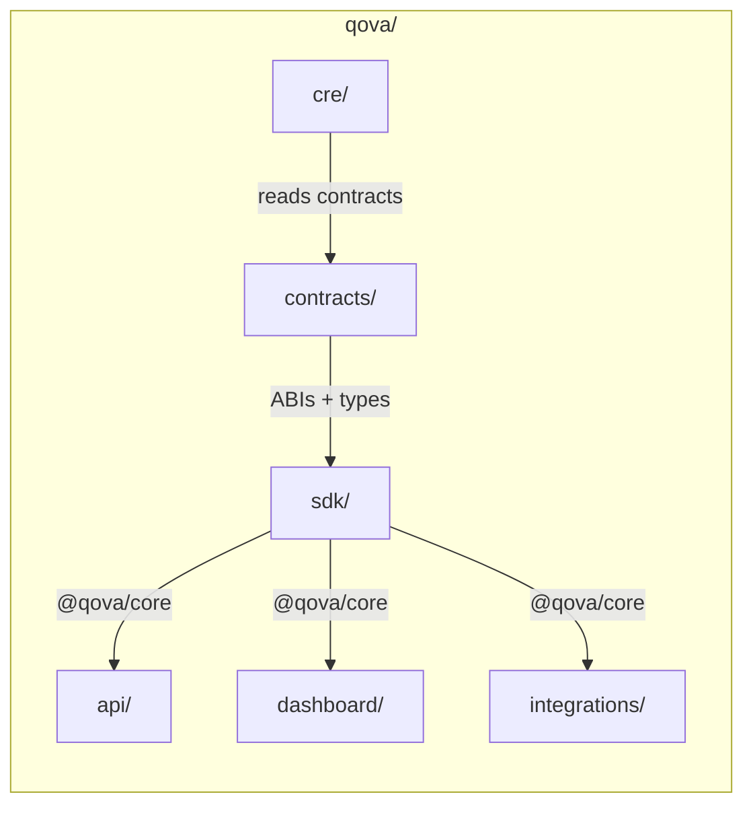
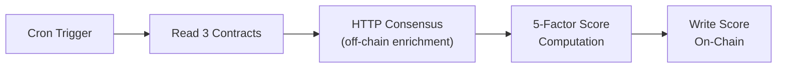
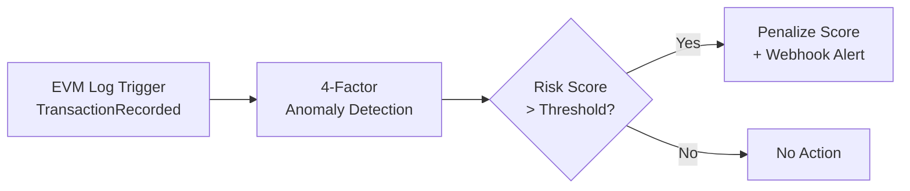
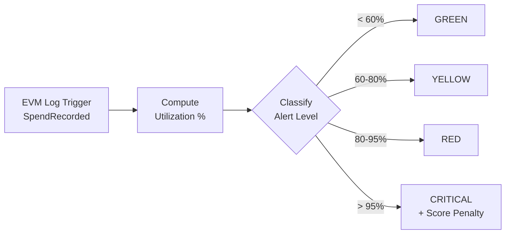

<p align="center">
  
</p>

<p align="center">
  <strong>Financial Trust Infrastructure for AI Agents</strong>
</p>

<p align="center">
  <a href="https://app.qova.cc">Dashboard</a> -
  <a href="https://docs.qova.cc">Docs</a> -
  <a href="https://qova.cc">Website</a>
</p>

<p align="center">
  
  
  
  
  
</p>

---

Qova is a credit bureau for autonomous AI agents. As agents transact on-chain via protocols like x402, Qova computes verifiable reputation scores (0-1000) from on-chain transaction data using Chainlink CRE, then writes those scores back on-chain for any protocol to consume. Think Equifax, but for AI.

## How It Works


### The Scoring Pipeline

```
1. Agent transacts on-chain          -->  Transaction recorded in smart contract
2. Chainlink CRE detects event       -->  4 decentralized workflows trigger
3. Workflows compute score factors   -->  BFT consensus across oracle nodes
4. Score written back on-chain       -->  Any protocol can read it
5. Dashboard updates in real-time    -->  Convex syncs instantly
```

### Credit Rating Scale

| Grade | Score | Risk Level | What It Means |
|:-----:|:-----:|:----------:|:-------------|
| **AAA** | 950-1000 | Minimal | Exceptional track record, highest trust |
| **AA** | 900-949 | Very Low | Excellent history, very reliable |
| **A** | 850-899 | Low | Strong performance, trustworthy |
| **BBB** | 750-849 | Moderate | Good standing, investment grade |
| **BB** | 650-749 | Notable | Fair record, room for improvement |
| **B** | 550-649 | Elevated | Adequate but limited history |
| **CCC** | 450-549 | High | Below average, caution advised |
| **CC** | 350-449 | Very High | Poor record, significant risk |
| **C** | 250-349 | Severe | Very poor, near default |
| **D** | 0-249 | Critical | Default risk, avoid |

### Scoring Factors

| Factor | Weight | Source |
|:-------|:------:|:-------|
| Success Rate | 30% | TransactionValidator contract |
| Transaction Volume | 25% | TransactionValidator contract |
| Transaction Count | 20% | TransactionValidator contract |
| Budget Compliance | 15% | BudgetEnforcer contract |
| Account Age | 10% | ReputationRegistry contract |

---

## Architecture



### Monorepo Packages

| Package | Description | Tech | Entry |
|:--------|:-----------|:-----|:------|
| [`contracts/`](./contracts) | On-chain reputation, transactions, budgets | Solidity 0.8.28, Foundry, OpenZeppelin v5 | `src/*.sol` |
| [`sdk/`](./sdk) | TypeScript SDK for all contract interactions | viem, Zod, ESM | `src/index.ts` |
| [`api/`](./api) | REST API with 21 endpoints, rate limiting, caching | Hono 4.7, Bun | `src/index.ts` |
| [`dashboard/`](./dashboard) | Real-time analytics dashboard with 21+ pages | Next.js 15, React 19, Convex, Clerk | `src/app/` |
| [`cre/`](./cre) | 4 Chainlink CRE decentralized scoring workflows | @chainlink/cre-sdk v1.1.2 | `*/index.ts` |
| [`integrations/`](./integrations) | Framework plugins for agent platforms | LangGraph, CrewAI, n8n | Per-package |

---

## Smart Contracts

Deployed and verified on **Base Sepolia** (Chain ID: 84532) and **SKALE Base** (Chain ID: 1187947933).

| Contract | Address (Base Sepolia) | Purpose |
|:---------|:----------------------|:--------|
| **ReputationRegistry** | [`0x0b2466b01E...563fBB`](https://sepolia.basescan.org/address/0x0b2466b01E6d73A24D9C716A9072ED3923563fBB) | Score storage (0-1000), agent registration, update history |
| **TransactionValidator** | [`0x5d7a7AEAb2...e900`](https://sepolia.basescan.org/address/0x5d7a7AEAb26D2F0076892D1C9A28F230EbB3e900) | Transaction recording, volume tracking, success rates |
| **BudgetEnforcer** | [`0x27161878...C76E`](https://sepolia.basescan.org/address/0x271618781040dc358e4F6B66561b65A839b0C76E) | Per-agent spending limits (daily/monthly/per-tx) |
| **QovaCore** | [`0x9Ee4ae0bD9...f76a`](https://sepolia.basescan.org/address/0x9Ee4ae0bD93E95498fB6AB444ae6205d56fEf76a) | Facade coordinating cross-contract operations |
| **QovaReputationConsumer** | - | CRE report consumer for on-chain score updates |
| **CrossChainReputation** | - | CCIP cross-chain reputation sync |
| **PriceFeedConsumer** | - | Chainlink price feed integration |

**Access Control** (OpenZeppelin v5):
- `UPDATER_ROLE` on ReputationRegistry (granted to QovaCore)
- `RECORDER_ROLE` on TransactionValidator (granted to QovaCore)
- `BUDGET_MANAGER_ROLE` on BudgetEnforcer (granted to QovaCore)

---

## Chainlink CRE Workflows

Four decentralized workflows built with `@chainlink/cre-sdk` v1.1.2. All computation functions are pure and deterministic for BFT consensus safety. **90 unit tests** across 6 test files.

### 1. Reputation Oracle



Scheduled workflow that reads agent data from all three contracts, fetches off-chain enrichment via HTTP consensus, computes the weighted score, and writes the result on-chain.

### 2. Transaction Monitor



| Risk Factor | Weight |
|:-----------|:------:|
| Frequency Anomaly | 30% |
| Large Value | 25% |
| Failure Rate | 25% |
| Flagged Contracts | 20% |

### 3. Budget Alert



### 4. Agent Verify

On-demand verification via HTTP POST. Runs **8 checks**: registration, contract existence, account age, owner consistency, activity level, ownership stability, sanctions screening, minimum score. Returns `VERIFIED` / `PARTIALLY_VERIFIED` / `UNVERIFIED` / `SUSPICIOUS` with credit grade.

---

## REST API

**21 endpoints** on Hono + Bun (port 3001). Rate-limited, cached, validated with Zod.

### Agent Endpoints

| Method | Path | Description | Rate Limit |
|:------:|:-----|:-----------|:----------:|
| `GET` | `/api/agents` | List all agents | 100/min |
| `GET` | `/api/agents/:address` | Agent details + enriched score | 100/min |
| `GET` | `/api/agents/:address/score` | Score + grade + color | 100/min |
| `POST` | `/api/agents/register` | Register new agent | 20/min |
| `POST` | `/api/agents/:address/score` | Update score | 100/min |
| `POST` | `/api/agents/batch-scores` | Batch update scores | 10/min |

### Transaction Endpoints

| Method | Path | Description | Rate Limit |
|:------:|:-----|:-----------|:----------:|
| `GET` | `/api/transactions/:address/stats` | Transaction statistics | 100/min |
| `POST` | `/api/transactions/record` | Record transaction | 100/min |

### Budget Endpoints

| Method | Path | Description | Rate Limit |
|:------:|:-----|:-----------|:----------:|
| `GET` | `/api/budgets/:address` | Budget status | 100/min |
| `POST` | `/api/budgets/:address/set` | Set spending limits | 100/min |
| `POST` | `/api/budgets/:address/check` | Check budget compliance | 100/min |
| `POST` | `/api/budgets/:address/spend` | Record spend | 100/min |

### Score Endpoints (CRE-Compatible)

| Method | Path | Description | Rate Limit |
|:------:|:-----|:-----------|:----------:|
| `GET` | `/api/scores/agents` | List agents (CRE format) | 100/min |
| `GET` | `/api/scores/:address` | Full score breakdown | 100/min |
| `POST` | `/api/scores/enrich` | Off-chain enrichment | 100/min |
| `POST` | `/api/scores/anomaly-check` | Anomaly detection | 100/min |
| `POST` | `/api/scores/compute` | Stateless score computation | 100/min |

### Verification Endpoints

| Method | Path | Description | Rate Limit |
|:------:|:-----|:-----------|:----------:|
| `POST` | `/api/verify` | Verify agent (8 checks) | 100/min |
| `POST` | `/api/verify/sanctions` | Sanctions screening | 100/min |

**Middleware:** CORS, 1MB body limit, IP rate limiting, 30s TTL cache on reads, Zod validation, structured error handling.

---

## SDK (`@qova/core`)

TypeScript SDK with typed wrappers for all contract interactions. ESM only, tree-shakeable.

### Quick Start

```typescript
import { createQovaClient } from "@qova/core";

// Read-only client (no wallet needed)
const client = createQovaClient({ chain: "base-sepolia" });

// Read an agent's score
const score = await client.getScore("0x1234...");
// => { score: 750, grade: "BBB", color: "#22C55E" }

// Check registration
const registered = await client.isAgentRegistered("0x1234...");

// Full details
const details = await client.getAgentDetails("0x1234...");

// Transaction stats
const stats = await client.getTransactionStats("0x1234...");

// Budget status
const budget = await client.getBudgetStatus("0x1234...");
```

### Write Operations

```typescript
import { createWalletClient, http } from "viem";
import { privateKeyToAccount } from "viem/accounts";
import { baseSepolia } from "viem/chains";
import { createQovaClient } from "@qova/core";

const wallet = createWalletClient({
  account: privateKeyToAccount("0x..."),
  chain: baseSepolia,
  transport: http(),
});

const client = createQovaClient({
  chain: "base-sepolia",
  walletClient: wallet,
});

await client.registerAgent("0xAgent...");
await client.updateScore("0xAgent...", 750, "0x00...reason");
await client.setBudget("0xAgent...", 1000000n, 10000000n, 100000n);
await client.recordTransaction("0xAgent...", "0xTxHash...", 5000n, 0);
```

### Event Watching

```typescript
import { watchTransactions, watchScoreUpdates } from "@qova/core";

// Real-time transaction feed
const unwatch = watchTransactions(client, (event) => {
  console.log(`Agent ${event.agent} - ${event.amount} wei`);
});

// Score update notifications
watchScoreUpdates(client, (event) => {
  console.log(`${event.agent}: ${event.oldScore} -> ${event.newScore}`);
});
```

### Exports

```typescript
// Client
import { createQovaClient } from "@qova/core";

// ABIs (for direct viem usage)
import {
  reputationRegistryAbi,
  transactionValidatorAbi,
  budgetEnforcerAbi,
  qovaCoreAbi,
} from "@qova/core/abi";

// Types + Zod schemas
import type {
  AgentDetails,
  BudgetStatus,
  TransactionStats,
  ScoreGrade,
} from "@qova/core/types";

// Utilities
import {
  getGrade,
  formatScore,
  shortenAddress,
  getScoreColor,
} from "@qova/core/utils";
```

---

## Dashboard

Real-time analytics dashboard at [app.qova.cc](https://app.qova.cc). Built with Next.js 15, React 19, Tailwind v4, shadcn/ui.

### Pages

| Route | Description |
|:------|:-----------|
| `/` | Overview with score summary, activity feed, alerts |
| `/agents` | Agent list with scores, grades, activity |
| `/agents/[address]` | Agent detail - score history, transactions, budget |
| `/transactions` | Transaction log with filters and recording |
| `/scores` | Reputation analytics and charts |
| `/budgets` | Budget management and utilization tracking |
| `/alerts` | Alert dashboard for score changes and budget warnings |
| `/verify` | Agent verification portal |
| `/verify/report/[address]` | Detailed credit report |
| `/ecosystem` | Ecosystem overview |
| `/cre` | CRE workflow monitoring |
| `/cre/[workflow]` | Workflow execution detail |
| `/integrations` | Integration catalog |
| `/developers/docs` | API documentation |
| `/developers/keys` | API key management |
| `/developers/webhooks` | Webhook configuration |
| `/settings` | Account, team, wallet, notifications |
| `/onboarding` | First-time setup wizard |

### Key Features

- **Multi-chain** - SKALE Base L3 (zero gas), Base L2, Base Sepolia
- **Multi-wallet** - MetaMask, Coinbase Wallet, WalletConnect, browser wallets
- **Real-time** - Convex for instant data sync
- **World ID** - Proof-of-personhood verification
- **Chain-adaptive UI** - Currency labels, explorer links, and data all adapt to selected chain
- **Dark mode first** - Black/white base with functional color only

---

## Integrations

Qova provides framework plugins to embed credit scoring directly into agent workflows.

| Framework | Package | Use Case |
|:----------|:--------|:---------|
| **LangGraph** | `@qova/langgraph` | Score-gated tool execution in LangChain agents |
| **CrewAI** | `@qova/crewai` | Trust-based task delegation between crew members |
| **n8n** | `@qova/n8n` | Workflow automation with reputation checkpoints |

### Integration Pattern

```typescript
// Example: Check agent score before executing a high-value action
import { createQovaClient } from "@qova/core";

const client = createQovaClient({ chain: "base-sepolia" });

async function executeWithTrustCheck(agentAddress: string, action: () => Promise<void>) {
  const { score, grade } = await client.getScore(agentAddress);

  if (score < 650) {
    throw new Error(`Agent ${agentAddress} score too low: ${grade} (${score})`);
  }

  await action();
  await client.recordTransaction(agentAddress, "0x...", amount, 0);
}
```

---

## Getting Started

### Prerequisites

- [Bun](https://bun.sh) v1.3+
- [Foundry](https://getfoundry.sh) (for contracts)

### Install and Build

```bash
git clone https://github.com/brn-mwai/qova.git
cd qova

bun install        # Install all dependencies
bun run build      # Build all packages
bun run test       # Run all tests
bun run check      # Lint and format (Biome)
```

### Individual Packages

```bash
# Smart contracts
cd contracts && forge build && forge test -vvv

# SDK
cd sdk && bun run build && bun run test

# API (port 3001)
cd api && bun run dev

# Dashboard (port 3000)
cd dashboard && bun run dev

# CRE workflows (90 tests)
cd cre && bun test

# CRE local simulation
cd cre && bun run simulate:reputation
```

### Seed Demo Data

```bash
cd dashboard
npx convex dev                                     # start local Convex
npx convex run mutations/seed:seedDemoData         # seed locally
npx convex run mutations/seed:seedDemoData --prod  # seed production
```

---

## Environment Variables

### Dashboard (`dashboard/.env.local`)

```env
CONVEX_DEPLOYMENT=                          # Convex deployment ID
NEXT_PUBLIC_CONVEX_URL=                     # Convex HTTP endpoint
NEXT_PUBLIC_CLERK_PUBLISHABLE_KEY=          # Clerk publishable key
CLERK_SECRET_KEY=                           # Clerk secret key
NEXT_PUBLIC_CHAIN_ID=84532                  # Default chain ID
NEXT_PUBLIC_EXPLORER_URL=                   # Block explorer base URL
NEXT_PUBLIC_WALLETCONNECT_PROJECT_ID=       # WalletConnect project ID
NEXT_PUBLIC_CDP_API_KEY=                    # Coinbase Developer Platform key
NEXT_PUBLIC_WORLDCOIN_APP_ID=              # World ID app ID
```

### API (`api/.env`)

```env
RPC_URL=                    # Base Sepolia RPC endpoint
DEPLOYER_PRIVATE_KEY=       # Contract deployer wallet private key
PORT=3001                   # API server port
```

---

## Tech Stack

| Layer | Technology | Why |
|:------|:----------|:----|
| **Runtime** | Bun | Fast, native TypeScript, built-in test runner |
| **Contracts** | Solidity 0.8.28 + Foundry | Industry standard, fast compilation |
| **Oracle** | Chainlink CRE SDK v1.1.2 | Decentralized computation with BFT consensus |
| **SDK** | TypeScript 5.7 + viem + Zod | Type-safe, tree-shakeable, runtime validation |
| **API** | Hono 4.7 on Bun | Lightweight, fast, middleware-friendly |
| **Dashboard** | Next.js 15 + React 19 | App Router, server components, streaming |
| **Database** | Convex | Real-time sync, transactional, serverless |
| **Auth** | Clerk + SIWE | Web3 native sign-in with Ethereum |
| **Wallet** | wagmi + viem | Multi-provider (MetaMask, Coinbase, WalletConnect) |
| **Identity** | World ID | Proof-of-personhood for sybil resistance |
| **Styling** | Tailwind v4 + shadcn/ui | Utility-first, accessible components |
| **Icons** | Phosphor Icons | Consistent, multiple weights |
| **Charts** | Recharts | Composable, responsive |
| **Monorepo** | Turborepo + Bun workspaces | Fast builds, dependency caching |
| **Linting** | Biome | Fast, single tool for lint + format |
| **CI/CD** | Vercel | Auto-deploy from main branch |

---

## Deployment

| Component | Platform | URL |
|:----------|:---------|:----|
| Dashboard | Vercel | [app.qova.cc](https://app.qova.cc) |
| Contracts | Base Sepolia + SKALE Base | On-chain |
| CRE Workflows | Chainlink CRE Network | Decentralized |
| Database | Convex Cloud | Real-time |
| Auth | Clerk | Managed |

---

## Team

- **Brian Mwai** - Architecture, smart contracts, CRE workflows, SDK, dashboard
- **Joy C. Langat** - Research, testing, documentation

---

## License

MIT
